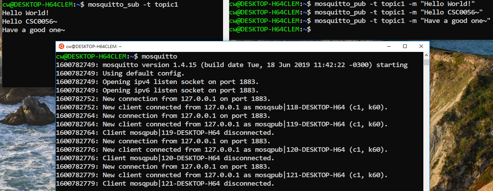

# CSC0056 Data Communication, Homework 1

[TOC]

## 1. Introduction

In this homework assignment, we will go through each step to setup both an Linux environment and [mosquitto](https://mosquitto.org), an open-source implementation of [the MQTT messaging protocol](https://mqtt.org).

If you already have a working Linux environment, be sure to read the following paragraph, and then you can jump to Section 3.

If you choose to use a Linux distribution other than [Ubuntu](https://ubuntu.com), you are responsible for handling issues for that distribution on your own. Different Linux distributions have some nuances in between. For this course, we suggest everyone to use Ubuntu to avoid irrelevant technical problems.

## 2. Install WSL and Ubuntu Linux

Please check out your Windows 10 and update it to version 1903 or higher (Build 18362 or higher for x64 systems).

For the following commands, run them in the PowerShell as *Administrator*:

`dism.exe /online /enable-feature /featurename:Microsoft-Windows-Subsystem-Linux /all /norestart`

Be sure to enable the "Virtual Machine Platform" optional feature:

`dism.exe /online /enable-feature /featurename:VirtualMachinePlatform /all /norestart`

Restart your computer to update to the WSL 2. Then execute the following command to set WSL 2 as the default version:

`wsl --set-default-version 2`

For more detail, take a look at [the official tutorial](https://docs.microsoft.com/zh-tw/windows/wsl/install-win10#install-your-linux-distribution-of-choice )

Now, log on the Microsoft Store and select Ubuntu (we recommend version 18.04). From the distribution's page, select "Get". You will need to create a user account and password for your new Linux distribution.

## 3. Install Mosquitto

Mosquitto is available in the Ubuntu repositories, so you can just install it using `apt`:

`sudo apt install mosquitto`

If that did not work, or if you want a more recent version of mosquitto, add the mosquitto-dev PPA to your repositories list:

`sudo apt-add-repository ppa:mosquitto-dev/mosquitto-ppa`

`sudo apt-get update`

and then try to install mosquitto using `apt` again.

Learn more at https://mosquitto.org/

## 4. Using Mosquitto

Now, let's have a quick test of the functionality of Mosquitto!

For this purpose, we may use two helpful utilities called `mosquitto_sub` and `mosquitto_pub`. 

Type the following commands in your Linux environment.

First of all, we need to run the broker:

`mosquitto`

Then, open the second terminal, and use `mosquitto_sub` to subscribe to a topic:

`mosquitto_sub -t topic1`

And then, to publish a message for a certain topic (assume the topic name is "topic1"), open the third terminal and execute `mosquitto_pub`:

`mosquitto_pub -t topic1 -m "your message"`

If everything works correctly, you should see that the second terminal shows the message received, and that the first terminal (where we ran the broker) shows some log messages.

The following is a screenshot of an example:

As shown in the screenshot, we ran mosquitto_sub once, and then we ran mosquitto_pub thrice, publishing messages "Hello World!", "Hello CSC0056~", and "Have a good one~", all of which are of the same topic. 

Now, type the following to learn more about their usage:

`man mosquitto`

`man mosquitto_pub`

`man mosquitto_sub`

## 5. Things to Submit to Moodle

To complete this homework assignment, do the following:

1. Use `mosquitto_sub` and `mosquitto_pub` to send three different messages of topic "topicHomework1" from a publisher to a subscriber. Take a screenshot of your result. See Section 4 above for an example.

2. Write a plain text file (not Word file), in which using your own words to summarize the purpose of those three [MQTT quality-of-service levels (i.e., QoS 0, QoS 1, and QoS 2)](https://docs.oasis-open.org/mqtt/mqtt/v5.0/os/mqtt-v5.0-os.html#_Toc3901234) **and** briefly explain which level is suitable for which type of applications. You are encouraged to survey related information on the Internet (e.g., , what does it mean by *quality-of-service* in the context of data communication?). **In any case, be sure to include your references at the end of the text file**.

Please compress both the screenshot and the plain text file into <u>one</u> zip file, and name the zip file by "your student id". Upload the zip file to Moodle to complete this homework assignment.

The submission deadline of this homework assignment is October 5th 9AM, according to the clock on Moodle.

You are encouraged to post your questions on Moodle, and you are highly encouraged to help answer others' questions! We are CSC0056 community.

Take heart, and enjoy : )

